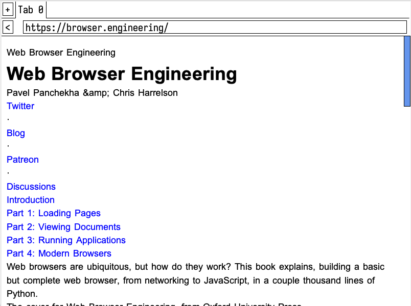

# giraffe

A web browser based off the book [browser.engineering](https://browser.engineering/) by Pavel Panchekha & Chris Harrelson.

The browser is implemented in Python and mostly a clone of the one developed in the book. There are some additions that include some of the exercises implemented, types annotated, and automated testing added. Gradually the work is being ported into Rust in a sister project, [goat](https://github.com/ttiimm/goat), which aims to be farther afield and more experimental around what a web browser could be.



## Usage

Start the browser by executing giraffe with a url.

```
usage: giraffe <url>
```

## Testing

For running a full suite of tests that requires Internet connectivity run.

```
$ pytest --runslow
```

Otherwise, the default execution of pytest excludes these tests.

